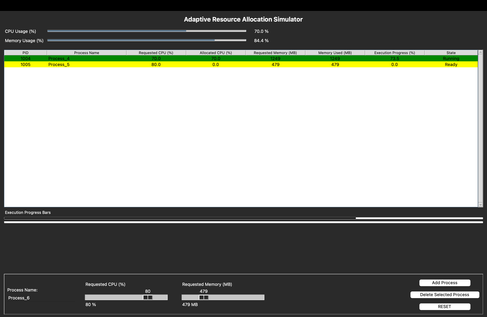
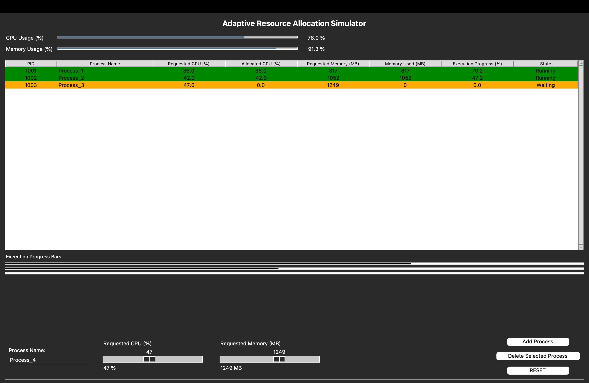
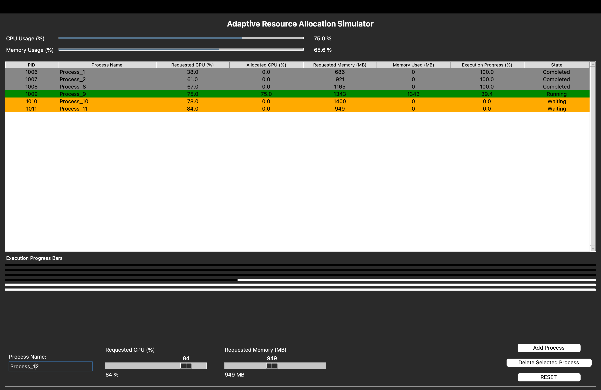

# Adaptive Resource Allocation Simulator

A real-time Python simulator demonstrating adaptive CPU and memory allocation in multiprogramming systems. The system dynamically schedules processes based on requested resources, assigns states (Ready, Running, Waiting, Completed), and visualizes execution using a Tkinter GUI.

---

## 🧠 Project Overview

This project simulates a multiprogramming environment where multiple processes request CPU time and memory. The scheduler continuously monitors available resources and allocates them based on system constraints. The GUI provides real-time visualization of:

- CPU usage percentage
- Memory usage percentage
- Dynamic process states
- Execution progress bars

The simulation prevents resource bottlenecks by automatically controlling which processes get CPU time and which must wait.

---

## 🧩 Problem Statement

In multiprogramming systems, multiple programs execute concurrently and share limited resources. Without proper scheduling:

- CPU might stay underutilized
- Memory can overflow
- Some processes may starve
- System performance decreases

This project demonstrates how **adaptive resource allocation** can improve stability, performance, and fairness.

---

## 🎯 Objectives

- Monitor real-time CPU and memory usage
- Simulate multiple processes with different resource requirements
- Dynamically assign process states:
  - **Running**
  - **Ready**
  - **Waiting**
  - **Completed**
- Prevent overload by limiting CPU to 100% and memory to 2048 MB
- Provide visual representation for understanding OS scheduling concepts

---

## 🏗️ System Architecture

**Frontend:**  
- Tkinter GUI  
- Treeview table for process list  
- Progress bars for execution visualization  

**Backend:**  
- Python  
- `threading` for concurrent scheduling and GUI updates  
- `psutil` for system usage monitoring  

**Process States Highlighting:**  
- 🟩 Green → Running  
- 🟨 Yellow → Ready  
- 🟧 Orange → Waiting  
- ⚪ Gray → Completed  

---

## ⚙️ Core Algorithms

### CPU Allocation
- Total CPU is capped at **100%**
- Processes get CPU time only if available CPU remains

### Memory Allocation
- Total memory limited to **2048 MB**
- If memory limit is reached → extra processes become *Waiting*

### Scheduling Loop
- Runs continuously in a background thread
- Updates progress based on allocated CPU

### Termination
- When progress reaches 100% → state changes to *Completed*

---

## 🧪 Case Demonstrations

### Case 1: Single Process Running
- Requested CPU: 10%
- Requested Memory: 256 MB  
→ System remains stable, no waiting state.

### Case 2: Multiple Ready Processes
- Two processes request CPU under 100%
→ Both get CPU allocated, ready queue visible.

### Case 3: Memory Bottleneck
- Requested memory exceeds available limit  
→ Extra processes enter *Waiting* state.

### Case 4: All States Together
Shows **Completed, Running, Ready, Waiting** simultaneously — ideal for viva demonstration.

---

## 📸 Screenshots

### Initial View


### Running & Ready


### Waiting State


### All Process States


---

## 🛠️ Technologies Used

| Component | Technology |
|---------|------------|
| Programming Language | Python |
| GUI | Tkinter |
| Monitoring | psutil |
| Concurrency | threading |
| Visualization | ttk Progressbars |

---

## 📂 File Structure

project.py          # Main simulator code
screenshots/        # Output demonstration images
README.md           # Documentation
LICENSE             # MIT open source license
.gitignore          # Python git ignore rules

---

## ▶️ How to Run

```bash
pip install psutil
python project.py
